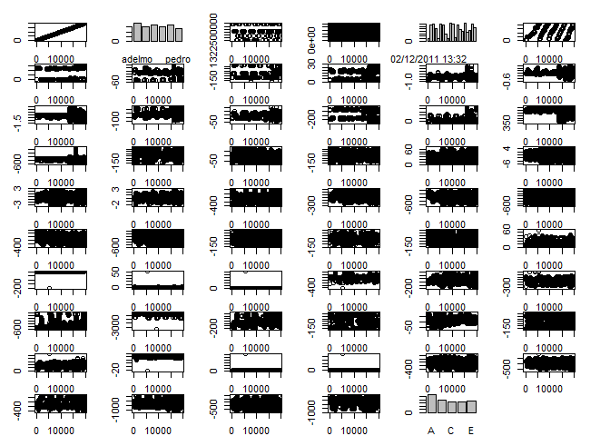
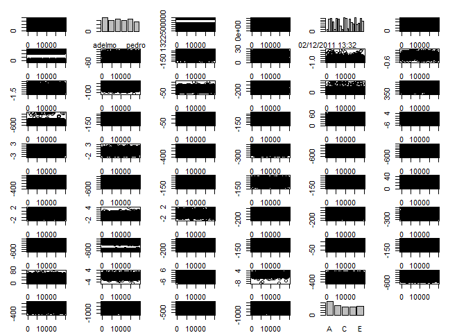
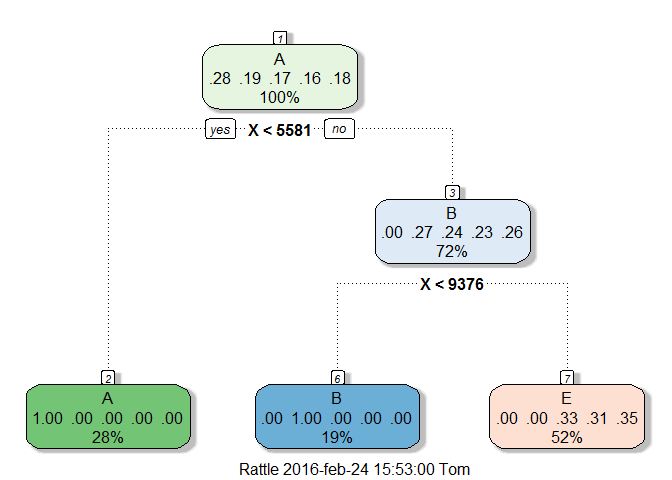
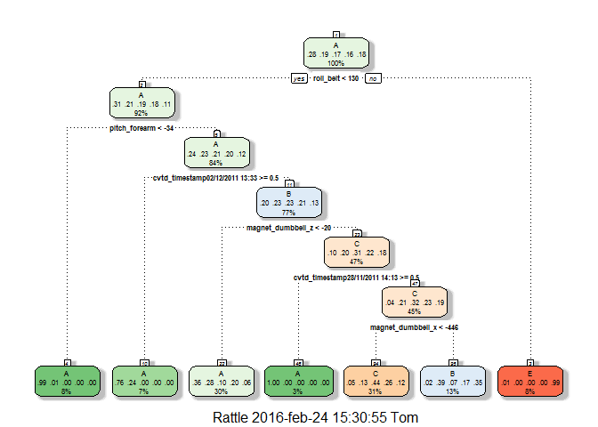

# Practical Machine Learning Course Project
Tom Geens  
#Introduction and datasets
The original source files for this project can be found at the [Groupware@LES' Human Activity Recognition webpage](http://groupware.les.inf.puc-rio.br/har) and the original publication on the [WLE dataset](http://groupware.les.inf.puc-rio.br/static/WLE/WearableComputing_weight_lifting_exercises_biceps_curl_variations.csv) can be downloaded [here](http://groupware.les.inf.puc-rio.br/public/papers/2013.Velloso.QAR-WLE.pdf).
For our course project, we'll first download the "training" and "testing" datasets from the coursera DS8 project website, have a look at their data structures, the numbers and properties of the variables, and identify the outcome variable. Moreover, we'll investigate how both coursera datasets relate to the original source dataset.


```r
par.default<-par()
if (!exists("training.csv")) {download.file("https://d396qusza40orc.cloudfront.net/predmachlearn/pml-training.csv","training.csv") 
}
training<-read.csv("training.csv")
#str(training)
length(training)
```

```
## [1] 160
```

```r
grep("classe",names(training))
```

```
## [1] 160
```

```r
if (!exists("testing.csv"))
{download.file("https://d396qusza40orc.cloudfront.net/predmachlearn/pml-testing.csv","testing.csv")
}
testing<-read.csv("testing.csv")
#str(testing)
length(testing)
```

```
## [1] 160
```

```r
grep("classe",names(testing))
```

```
## integer(0)
```

```r
if (!exists("complete.csv"))
{download.file("http://groupware.les.inf.puc-rio.br/static/WLE/WearableComputing_weight_lifting_exercises_biceps_curl_variations.csv","complete.csv")
}
complete<-read.csv("complete.csv")
X<-c(1:39242)
complete<-data.frame(X,complete)
completedummy<-training[-c(1:19622),]
completedummy<-rbind(completedummy,complete)
complete<-completedummy;rm(completedummy)
#str(complete)
length(complete)
```

```
## [1] 160
```

```r
grep("classe",names(complete))
```

```
## [1] 160
```

The coursera "training" and "testing" datasets contain 160 variables. The first variable (X) contains the case record id for both datasets. In the "training" dataset, the last variable contains the outcome (classe). The "testing" dataset for the project however, does not contain our variable of interest: the outcome variable "classe" has been replaced by the variable "problem_id" (id's from 1 to 20).  
We should not confuse this "testing" dataset  with a real test dataset (to be defined) to test our predictions since 20 cases are not enough for "testing" a prediction algorithm given the size of the provided "training" dataset. A more appropriate name would be "little quiz" dataset in stead of "testing" dataset.   
The original dataset "complete" (39242 cases) is twice as large as the "training" set for the exercise (19622 cases). It does not contain an index variable X like the training and testing datasets from the course (so we'll add an X variable to identify cases in this source dataset), but it does contain the outcome variable "classe".  
Let's find which cases of the "complete" dataset were filtered out to subset the "training" and "testing" datasets for the coursera project. With this information, we can construct a "complement" dataset: "complete" source dataset minus coursera "training" minus coursera "testing". This "complement" will be our dataset for validation of our prediction algorithms.


```r
library(dplyr)
trainingrowindexes<-inner_join(complete,training[,3:4])[,1]
testingrowindexes<-inner_join(complete,testing[,3:4])[,1]
complementrowindexes<-X[-c(testingrowindexes,trainingrowindexes)]
completerowindexes<-X
checklength<-length(trainingrowindexes)+length(testingrowindexes)+length(complementrowindexes)
complement<-complete[-c(trainingrowindexes,testingrowindexes),]
head(training[1:2,1:7],2)
head(testing[1:2,1:7],2)
head(complement[1:6,1:7],6)
head(complete[1:6,1:7],6)
```


#Manual pre-processing
For the pre-processing we'll consider two important points:  

* which near zero variables can be excluded?  
* which remaining variables require further cleanup according to exploratory data analysis?  
* which remaining variables might need to be excluded according to exploratory data analysis?  

##Near zero variables to be excluded
Let's find which variables for the "training", "testing", "complement" and "complete" datasets have near zero variance. Those variables do not contain relevant information to build our models. They can be excluded from further analysis.


```r
library(caret)
nzvtrainingcolindexes<-nearZeroVar(training)
nzvtestingcolindexes<-nearZeroVar(testing)
nzvcomplementindexes<-nearZeroVar(complement)
nzvcompletecolindexes<-nearZeroVar(complete)
length(nzvtrainingcolindexes)
```

```
## [1] 60
```

```r
length(nzvtestingcolindexes)
```

```
## [1] 101
```

```r
length(nzvcomplementindexes)
```

```
## [1] 54
```

```r
length(nzvcompletecolindexes)
```

```
## [1] 62
```

Since our model has to be able to predict the 20 cases from the quiz dataset, only the non-near zero variance variables of this small 20 cases "testing" dataset are relevant for our prediction model. This means that in a first step already 101 of the 160 variables can be excluded. 


```r
trainingexnzv<-training[,-nzvtestingcolindexes]
testingexnzv<-testing[,-nzvtestingcolindexes]
complementexnzv<-complement[,-nzvtestingcolindexes]
completeexnzv<-complete[,-nzvtestingcolindexes]
```

##Remaining variables requiring further clean up
We'll first plot all cases from the remaining variables of the "training" dataset univariate against their row index.


```r
par(fin=c(10,6),oma=c(1,1,1,1),mar=c(1,2,1,2))
par(mfrow=c(10,6))
plot(trainingexnzv[,1],fin=c(1,1))
for(i in 2:59){plot(trainingexnzv[,i])}
par(par.default)
```




We learn that variables 37, 38, 39 (seventh row, first three), 44 (eigth row, second one) and 50, 51, 52 (ninth row, second, third and fourth) contain extreme values which might negatively effect the model building. Let's identify these outliers and exclude them from the analysis.


```r
outliertrainingexnzv1<-data.frame(trainingexnzv[which(trainingexnzv[,51]==max(abs(trainingexnzv[,51]))),])
outliertrainingexnzv2<-data.frame(trainingexnzv[which(trainingexnzv[,44]==min(trainingexnzv[,44])),])
outliertrainingexnzv<-rbind(outliertrainingexnzv1,outliertrainingexnzv2)
trainingexnzvexo<-anti_join(trainingexnzv,outliertrainingexnzv[,3:4])
```

We'll do the same plot again, now without both outliers.


```r
par(fin=c(10,6),oma=c(1,1,1,1),mar=c(1,2,1,2))
par(mfrow=c(10,6))
plot(trainingexnzvexo[,1],fin=c(1,1))
for(i in 2:59){plot(trainingexnzvexo[,i])}
par(fin=c(7.166666,7.156249),oma=c(1,1,1,1),mar=c(1,2,1,2))
```



The picture looks much better after removal of the two cases X=5373 and X=9274 from the "training" dataset: both cases were clear outliers distorting the plotting pattern of 7 variables. 


##Other variables which might need to be excluded
The last variable [,59] is the outcome variable and should in any case be left out as a predictor for calibration of the models. 
If we look at the first plot again, wenotice that the first variable [,1] is just an index (1:19622) which should not have any explanatory value. The same is true for the variables [,c(3,4,6] which are time-indicators and not indicators of the quality of the exercise. We'll fit our models once with and once without these variables to assess the impact on our modelling strategy.

#Modelling
##Strategy
Since the outcome variable is categorical, we choose to use a tree as well as a random forest approach. 
We'll use the R caret package to split the "training" dataset into a "trainds" dataset (with 75% random cases from the "training" dataset) to train our model and a "testds" dataset (the remaining 25%) to test it.
We'll use the "complement" dataset to validate our model and to calculate the out of sample error.
We'll make two versions of both models: once with the record id and time indicator variables, once without them.


```r
#create inTrain selection and testds
set.seed=12345
inTrain<-createDataPartition(y=trainingexnzvexo$classe,p=0.75,list=FALSE)
trainds<-trainingexnzvexo[inTrain,]
testds<-trainingexnzvexo[-inTrain,]
```


##Tree model (CART)
###Tree model with record id and time indicator variables: modTree0

```r
#modTree0
start.time<-Sys.time()
if (!exists("modTree0")){modTree0<-train(trainds[,59]~.,method="rpart",data=trainds[,-c(59)])}
stop.time<-Sys.time()
modTree0.time<-round(difftime(stop.time,start.time,units="secs"),0)[[1]]
rattle::fancyRpartPlot(modTree0$finalModel)
```



```r
confusionMatrix(trainds[,59],predict(modTree0,trainds))
confusionMatrix(testds[,59],predict(modTree0,testds))
confusionMatrix(complement[,160],predict(modTree0,complement,na.action=na.pass))
modTree0.pred.trainds<-predict(modTree0,trainds)
modTree0.pred.testds<-predict(modTree0,testds)
modTree0.pred.complement<-predict(modTree0,complement)
modTree0.pred.testing<-predict(modTree0,testing)
```

Our modTree0 model takes <0.01 seconds to build and has an accuracy of 66.17% on the trainds and 66,16% on the testds that drops out of sample (complement dataset) to 14.21% (worse than guessing randomly, wich should lead to a 20.00% accuracy...)

###Tree model without record id and time indicator variables: modTree1

```r
#modTree1
start.time<-Sys.time()
if (!exists("modTree1")){modTree1<-train(trainds[,59]~.,method="rpart",data=trainds[,-c(1,3,4,6,59)])}
stop.time<-Sys.time()
modTree1.time<-round(difftime(stop.time,start.time,units="secs"),0)[[1]]
rattle::fancyRpartPlot(modTree1$finalModel)
```



```r
confusionMatrix(trainds[,59],predict(modTree1,trainds))
confusionMatrix(testds[,59],predict(modTree1,testds))
confusionMatrix(complement[,160],predict(modTree1,complement,na.action=na.pass))
modTree1.pred.trainds<-predict(modTree1,trainds)
modTree1.pred.testds<-predict(modTree1,testds)
modTree1.pred.complement<-predict(modTree1,complement)
modTree1.pred.testing<-predict(modTree1,testing)
```

Our modTree1 model has an accuracy of 59.26% on the trainds and 58,37% on the testds. Out of sample (complement dataset) it remains at 59.29%. This proves that excluding the record id and time-indicator variables is very important: they did not affect the results of the predictions for testds, the 25% subset of the coursera training dataset, but they did disturb the analysis of another portion of the original source dataset!


###Random forest model with record id and time indicator variables: modRf0
The first random forest models we ran, we used the default settings of the train function. We repeated them afterwards with the defaultsettings of the randomForest function. With train, a calculation took >1h, with randomForest the same calculation took only 5 min. Whenever you can: use randomForest! We included the argument do.trace=TRUE, in order to see the progress of the modelling (the console prints the progress for processing the default number of 500 trees).


```r
#modRf
library(randomForest)
start.time<-Sys.time()
if (!exists("modRf0")){modRf0<-randomForest(trainds[,59]~.,method="rf",data=trainds,do.trace=TRUE)}
stop.time<-Sys.time()
modRf0.time<-round(difftime(stop.time,start.time,units="secs"),0)[[1]]

confusionMatrix(trainds[,59],predict(modRf0,trainds))
confusionMatrix(testds[,59],predict(modRf0,testds))
confusionMatrix(complement[,160],predict(modRf0,complement))
modRf0.pred.trainds<-predict(modRf0,trainds)
modRf0.pred.testds<-predict(modRf0,testds)
modRf0.pred.complement<-predict(modRf0,complement,na.action=na.pass)
```

Our modRf0 model has an accuracy of 100.00% on the trainds and 99,92% on the testds, and out of sample (complement dataset) 99.82%. In contrast to the tree model, the effect of keeping the record id and time-indicator variables in the modelling function is less dramatic.

###Random forest model without record id and time indicator variables: modRf1

```r
start.time<-Sys.time()
if (!exists("modRf1")){modRf1<-randomForest(trainds[,59]~.,method="rf",data=trainds[,-c(1,3,4,6,59)],do.trace=TRUE)}
stop.time<-Sys.time()
modRf1.time<-round(difftime(stop.time,start.time,units="secs"),0)[[1]]

confusionMatrix(trainds[,59],predict(modRf1,trainds))
confusionMatrix(testds[,59],predict(modRf1,testds))
confusionMatrix(complement[,160],predict(modRf1,complement))
modRf1.pred.trainds<-predict(modRf1,trainds)
modRf1.pred.testds<-predict(modRf1,testds)
modRf1.pred.complement<-predict(modRf1,complement,na.action=na.pass)
```

Our modRf1 model has an accuracy of 100.00% on the trainds and 99,73% on the testds, and out of sample (complement dataset) 99.69%. In contrast to the tree model, the effect of excluding the record id and time-indicator variables in the modelling function does not improve the model.

###Random forest model without record id and time indicator variables and non-default values for the trainControl argument: modRf2, modRf3 and modRf4
In this last part we'll run the same random forest models as modRf1, except that we'll use different trainControl settings:  

* modRf2 uses "cv"  
* modRf3 uses "repatedcv"  
* modRf4 uses "LOOCV"  


In table 1, the solution to the quiz is shown as predicted with the different models. All Random forest models come to the same conclusion. The predictions with the two tree models clearly diverge from the solutions provided by the random forest models.


```r
library(knitr)
kable(predictions,caption="Table 1: Prediction results from our different models")
```


Table: Table 1: Prediction results from our different models

         problem_id  modTree0   modTree1   modRf0   modRf1   modRf2   modRf3   modRf4 
------  -----------  ---------  ---------  -------  -------  -------  -------  -------
38981             1  E          A          B        B        B        B        B      
11396             2  E          B          B        B        B        B        B      
11500             3  E          B          B        B        B        B        B      
20108             4  E          C          B        B        B        B        B      
2115              5  A          B          A        A        A        A        A      
18643             6  E          A          A        A        A        A        A      
16380             7  E          A          B        B        B        B        B      
13548             8  E          B          E        E        E        E        E      
21141             9  E          C          C        C        C        C        C      
20143            10  E          C          B        B        B        B        B      
22281            11  E          C          D        D        D        D        D      
14564            12  E          A          A        A        A        A        A      
3257             13  A          A          B        B        B        B        B      
10492            14  E          A          A        A        A        A        A      
19793            15  E          A          A        A        A        A        A      
8550             16  B          A          A        A        A        A        A      
30143            17  E          A          A        A        A        A        A      
23150            18  E          C          E        E        E        E        E      
35271            19  E          C          E        E        E        E        E      
3173             20  A          A          B        B        B        B        B      

In table 2, a basic summary of our models is shown: the accuracies for the trainds and testds (75% and 25% of the coursera "training" dataset as well as for the "complement" dataset (a validation dataset to test our out of sample accuracy), the computation time needed to build the models, and finally the proportion of correct values for the coursera quiz "testing", assuming that our near 100% accuracy random forest models will not make prediction errors for these 20 questions.


```r
kable(comparisons,captions="Table 2: Two basic properties of our different models")
```

                             modTree0   modTree1   modRf0   modRf1   modRf2   modRf3   modRf4
--------------------------  ---------  ---------  -------  -------  -------  -------  -------
Accuracy trainds (%)            66.17      59.26   100.00   100.00   100.00   100.00   100.00
Accuracy testds (%)             66.16      58.37    99.92    99.61    99.65    99.97    99.67
Accuracy complementds (%)       14.21      59.29    99.82    99.65    99.54    99.59    99.55
Computation Time (secs)         21.00      36.00    63.00    98.00   100.00   101.00    97.00
Proportion Correct (-)           0.20       0.45     1.00     1.00     1.00     1.00     1.00

From table two we can conclude that the randomForest models are much better than the tree models. Within the randomForest models we notice that the effect of cleaning out unnecessary variables is les dramatic than for the tree models. Finally we can conclude that the differences between the randomForest models are non-significant. However: the computation time for modRf0 (the simplest one) is smallest. we will retain this model as our final model and use it to produce the answers to the quiz. 
